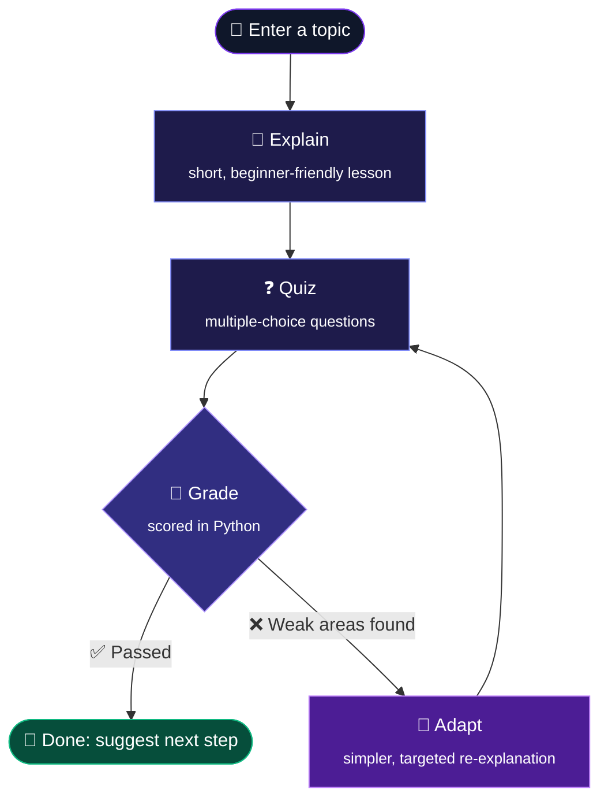
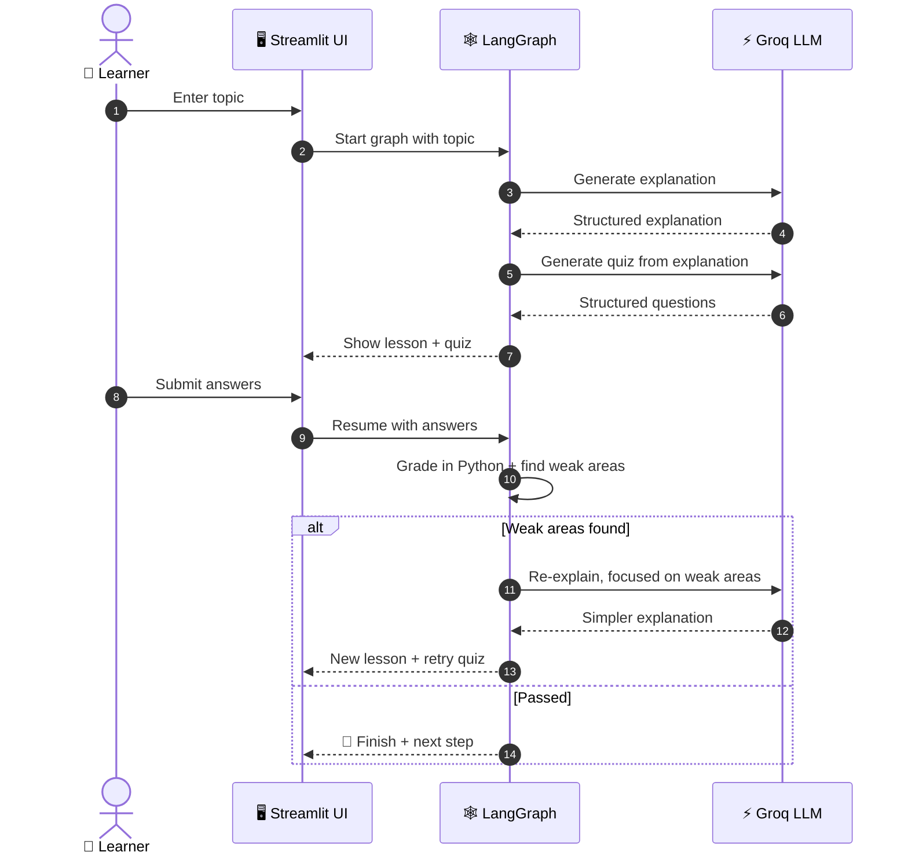

<div align="center">


<a href="#-quick-start">
  
</a>

<br/>


**A lightweight AI study coach that teaches a topic, quizzes you, and rewrites the next explanation around your mistakes.**

[🚀 Quick Start](#-quick-start) •
[🧠 How It Works](#-how-it-works) •
[🕹️ Walkthrough](#%EF%B8%8F-interactive-walkthrough) •
[🏗️ Architecture](#%EF%B8%8F-architecture) •
[🗺️ Roadmap](#%EF%B8%8F-roadmap)

</div>

---

## 🌌 Overview

Most AI study tools are a chatbot with a nicer skin. You ask, it answers, and it never checks whether anything stuck.

**StudyFlow works differently.** It runs a small **stateful learning loop** built with LangGraph. Each step (explaining, quizzing, grading, adapting) is its own node in a graph, and the graph decides what happens next based on how *you* actually did.

```text
╭──────────╮     ╭──────────╮     ╭──────────╮     ╭──────────╮     ╭──────────╮
│  TOPIC   │ ──▶ │ EXPLAIN  │ ──▶ │   QUIZ   │ ──▶ │  GRADE   │ ──▶ │  ADAPT   │
╰──────────╯     ╰──────────╯     ╰────▲─────╯     ╰────┬─────╯     ╰────┬─────╯
                                       │                │                │
                                       │           pass ▼                │ weak areas
                                       │          ╭──────────╮           │
                                       │          │   DONE   │           │
                                       │          ╰──────────╯           │
                                       ╰─────────────────────────────────╯
```

> 💡 **The idea:** the second explanation you get is written for the mistakes you made on the first quiz, not generated from scratch.

---

## ✨ Features

<table>
<tr>
<td width="50%" valign="top">

### 🔄 Adaptive Explanations
Wrong answers are mapped back to the concepts behind them. The next explanation is **simpler, uses a new angle, and focuses on those weak concepts**.

</td>
<td width="50%" valign="top">

### 🕸️ Stateful Workflow
**LangGraph** runs the learning flow as a state machine rather than one giant prompt. Every step is small, testable and easy to change.

</td>
</tr>
<tr>
<td width="50%" valign="top">

### 🎯 Deterministic Scoring
Quiz answers are graded in **plain Python**, not by the LLM. Scores stay exact and reproducible, and the model can't hallucinate them.

</td>
<td width="50%" valign="top">

### ⚡ Fast Inference
**Groq**-hosted models keep response times low, so the loop feels interactive instead of sluggish.

</td>
</tr>
<tr>
<td width="50%" valign="top">

### 🧩 Structured Output
LLM responses (explanations, quiz questions) come back in a fixed structure, so the app never has to scrape free-form text.

</td>
<td width="50%" valign="top">

### 🎨 Minimal UI
**Streamlit** keeps it a single `streamlit run` command, with no separate frontend build. It's easy to run locally and deploy for free.

</td>
</tr>
</table>

---

## 🧠 How It Works



| Stage | What happens | Powered by |
|:--|:--|:--|
| 📖 **Explain** | The topic is turned into a short, clear explanation | LLM (Groq) |
| ❓ **Quiz** | Questions are generated from *that* explanation | LLM (Groq) |
| 🧮 **Grade** | Answers are checked and scored | Pure Python |
| 🔁 **Adapt** | Weak areas are fed back into a simpler re-explanation | LLM + graph state |
| 🧭 **Route** | The graph decides: retry the loop or finish | LangGraph conditional edge |

---

## 🕹️ Interactive Walkthrough

> Click each step to expand it.

<details>
<summary><b>① You pick a topic: <code>Binary Search</code></b></summary>
<br/>

You type any topic into the app. It can be as rough as `"how does binary search even work??"`. StudyFlow cleans it up and starts the graph.

</details>

<details>
<summary><b>② StudyFlow explains it</b></summary>
<br/>

> **Binary Search** finds an item in a *sorted* list by repeatedly checking the middle and throwing away the half that can't contain the answer.
>
> 🧠 *Analogy:* finding a word in a dictionary. You open near the middle, see you're too far, and flip back.

</details>

<details>
<summary><b>③ You take a 3-question quiz</b></summary>
<br/>

```text
Q1. What must be true about the list before using binary search?
    ○ It must contain numbers only
    ● It must be sorted                ✅
    ○ It must have an even length
    ○ It must have no duplicates

Q2. What is the time complexity of binary search?
    ● O(n)                             ❌
    ○ O(log n)
    ...
```

</details>

<details>
<summary><b>④ StudyFlow grades you and finds weak areas</b></summary>
<br/>

```text
┌───────────────────────────────┐
│  Score: 1 / 3   (33%)         │
│  Weak area: time complexity   │
│  Status: 🔁 re-explaining...  │
└───────────────────────────────┘
```

Grading happens in Python, so the score is exact. The concepts behind the wrong answers are stored in the graph state.

</details>

<details>
<summary><b>⑤ You get a targeted re-explanation, then retry</b></summary>
<br/>

> Each step cuts the list **in half**. 1,000 items → 500 → 250 → … → 1 takes about **10 steps**, not 1,000. That "keep halving" pattern is what **O(log n)** means.

Then you get a fresh quiz focused on the concepts you missed. 🎯

</details>

---

## 🏗️ Architecture



<details>
<summary><b>🧬 What the graph state tracks</b> (click to expand)</summary>
<br/>

The graph passes one shared state object between nodes. A simplified version:

```python
class StudyState(TypedDict):
    topic: str              # what the learner wants to learn
    explanation: str        # the current lesson
    quiz: list[dict]        # questions, options, correct answers
    answers: list[str]      # what the learner picked
    score: float            # computed in Python
    weak_areas: list[str]   # concepts to target next
    attempts: int           # how many loops so far
```

Each node reads what it needs and returns only the fields it changes. LangGraph merges the result.

</details>

<details>
<summary><b>🧭 Why LangGraph instead of one big prompt?</b></summary>
<br/>

| One giant prompt | LangGraph workflow |
|:--|:--|
| ❌ The model decides the flow | ✅ Code decides the flow |
| ❌ Hard to debug | ✅ Each node can be tested on its own |
| ❌ The score is whatever the model says | ✅ The score is computed in Python |
| ❌ No memory of past mistakes | ✅ Weak areas live in state and drive the next step |
| ❌ Hard to extend | ✅ Add a node, add an edge, done |

</details>

---

## 🛠️ Tech Stack

<div align="center">

| Layer | Tool | Role |
|:--:|:--:|:--|
| 🐍 | **Python 3.10+** | Core language |
| 🖥️ | **Streamlit** | UI and app server |
| 🔗 | **LangChain** | Prompt templates + structured LLM calls |
| 🕸️ | **LangGraph** | Stateful workflow / learning loop |
| ⚡ | **Groq** | Fast LLM inference |
| 🔐 | **python-dotenv** | Loads API keys from `.env` |

</div>

---

## 🚀 Quick Start

**1. Clone and set up**

```bash
git clone <your-repo-url>
cd studyflow
python -m venv .venv
```

<details open>
<summary><b>2. Activate the virtual environment</b></summary>
<br/>

```bash
# 🪟 Windows
.venv\Scripts\activate

# 🍎 macOS / 🐧 Linux
source .venv/bin/activate
```

</details>

**3. Install dependencies**

```bash
pip install -r requirements.txt
```

**4. Add your keys.** Copy `.env.example` to `.env`:

```env
GROQ_API_KEY=your_groq_api_key
GROQ_MODEL=llama-3.3-70b-versatile
```

> 🔑 Get a free API key at **[console.groq.com/keys](https://console.groq.com/keys)**

**5. Launch 🚀**

```bash
streamlit run app.py
```

Open **http://localhost:8501** and pick a topic.

---

## ⚙️ Configuration

| Variable | Required | Default | Description |
|:--|:--:|:--|:--|
| `GROQ_API_KEY` | ✅ | — | Your Groq API key |
| `GROQ_MODEL` | ❌ | `llama-3.3-70b-versatile` | Any Groq chat model |

---

## 📁 Project Structure

```text
studyflow/
├── 🖥️ app.py              # Streamlit UI: topic input, lesson, quiz, results
├── 📦 requirements.txt    # Python dependencies
├── 🔐 .env.example        # Template for your API keys
├── 🙈 .gitignore          # Keeps .env and venvs out of git
├── 📘 README.md           # You are here
└── 🧠 src/
    ├── graph.py           # LangGraph nodes, edges, and routing logic
    └── prompts.py         # Prompt templates for explain / quiz / re-explain
```

---

## ☁️ Deploy in 2 Minutes

<details>
<summary><b>Streamlit Community Cloud (free)</b></summary>
<br/>

1. Push this repo to GitHub
2. Go to **[share.streamlit.io](https://share.streamlit.io)** → **New app**
3. Select your repo and set the main file to `app.py`
4. Under **Advanced settings → Secrets**, add:
```toml
   GROQ_API_KEY = "your_groq_api_key"
   GROQ_MODEL = "llama-3.3-70b-versatile"
```
5. Click **Deploy** 🎉

</details>

<details>
<summary><b>Render / Railway</b></summary>
<br/>

- **Build command:** `pip install -r requirements.txt`
- **Start command:** `streamlit run app.py --server.port $PORT --server.address 0.0.0.0`
- Add `GROQ_API_KEY` and `GROQ_MODEL` as environment variables

</details>

---

## 🩺 Troubleshooting

<details>
<summary><b>❗ <code>GROQ_API_KEY</code> not found</b></summary>
<br/>

Make sure `.env` is in the project root (next to `app.py`), not inside `src/`, and that you restarted Streamlit after creating it.

</details>

<details>
<summary><b>❗ Rate limit errors (429)</b></summary>
<br/>

The free Groq tier has per-minute limits. Wait a few seconds and try again, or switch `GROQ_MODEL` to a smaller model.

</details>

<details>
<summary><b>❗ <code>ModuleNotFoundError</code></b></summary>
<br/>

Your virtual environment probably isn't active. Activate it (step 2) and run `pip install -r requirements.txt` again.

</details>

---

## 🗺️ Roadmap

- [x] Topic → Explain → Quiz → Grade → Adapt loop
- [x] Deterministic Python scoring
- [x] Targeted re-explanations from weak areas
- [ ] 📄 PDF-based learning mode: learn from your own notes
- [ ] 📈 Persistent mastery scores per concept
- [ ] 🗓️ Spaced repetition for weak topics
- [ ] 💬 Chat and session history
- [ ] 💻 Coding-question mode
- [ ] 🎚️ Difficulty levels (beginner → advanced)

---

## 🤝 Contributing

Ideas, issues and PRs are welcome.

```bash
git checkout -b feature/amazing-idea
git commit -m "Add amazing idea"
git push origin feature/amazing-idea
```

Then open a Pull Request 🚀

---

## 📜 License

Released under the **MIT License**. Use it, fork it, learn from it.

<div align="center">

<br/>

**If StudyFlow helped you learn something, consider leaving a ⭐**


</div>