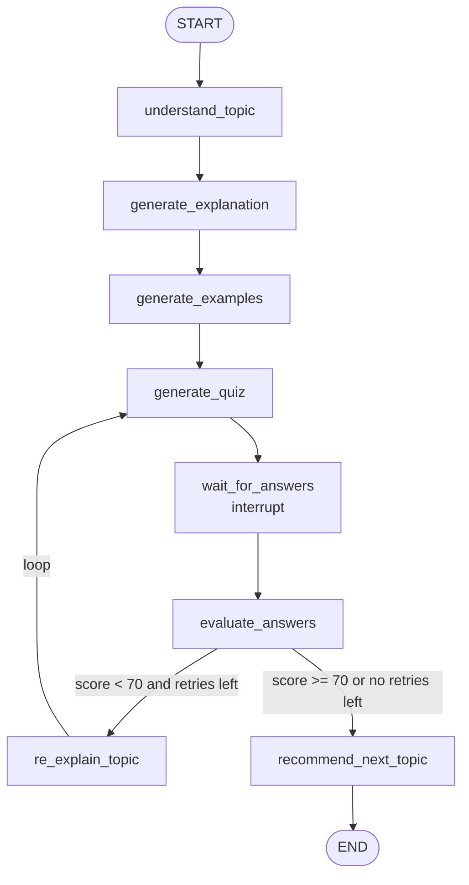
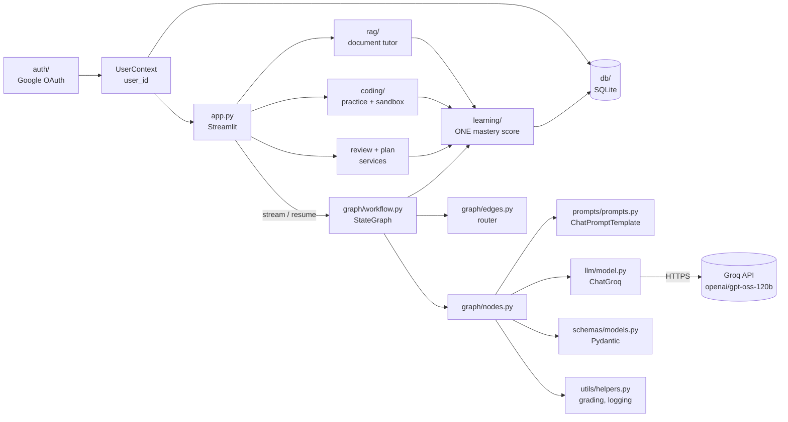
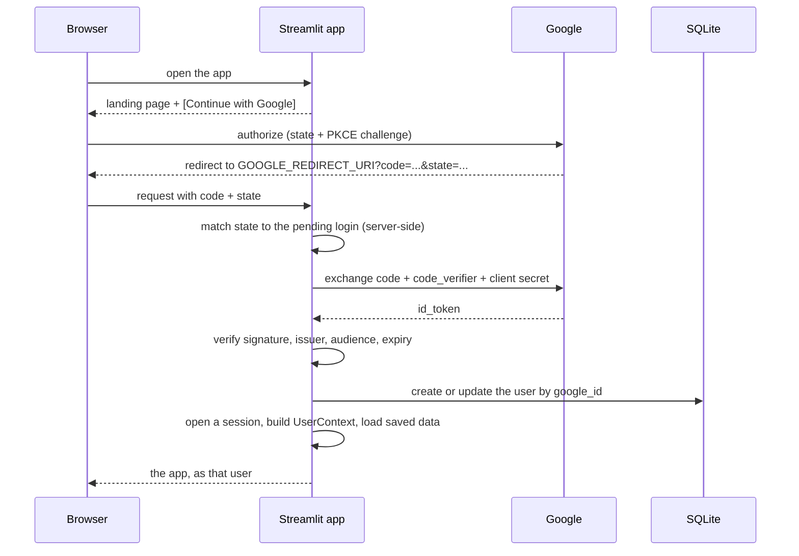

# AI Study Assistant

An adaptive learning platform built with **LangChain + LangGraph + Groq + Streamlit**.

You sign in with Google, type a topic, and the assistant explains it, gives examples, quizzes you,
grades your answers and then **decides what to do next**: re-explain it more
simply if you struggled, or recommend a next topic if you passed.

The main purpose of this project is to **learn LangChain and LangGraph** by building
something real. Every file is small and heavily commented.
After reading this README, open **[LEARNING_GUIDE.md](LEARNING_GUIDE.md)** for a file-by-file walkthrough.

---

It is four things on one knowledge graph: a tutor that teaches and quizzes you, a document
tutor that answers from your own notes with citations, a spaced-repetition reviewer, and a
coding practice platform — all writing to a single per-concept mastery score.
See [section 14](#14-the-learning-platform) for how they fit together.

## 1. What the project does

0. **Signs you in with Google**, so every topic, quiz and score belongs to your account
1. **Understands** your topic (clean title, key concepts, prerequisites)
2. **Explains** it at a beginner level (definition, why it matters, how it works, analogy)
3. **Generates 2–4 examples**
4. **Generates a 5-question quiz** (4 options each)
5. **Waits** while you answer in the browser
6. **Evaluates** your answers (score in Python, feedback from the LLM)
7. **Updates your mastery** for every concept the quiz touched, classifies any mistake, and
   schedules a revision
8. **Routes** on mastery, not only the score:
   - weak → re-explains more simply and gives a **shorter, easier quiz** (max 2 retries)
   - ready → **recommends the next topic**, at a difficulty matched to what you now know

## 2. Why LangChain?

LangChain gives us standard building blocks for talking to LLMs:

| Building block | Where we use it |
|---|---|
| `ChatGroq` chat model | [llm/model.py](llm/model.py) |
| `ChatPromptTemplate` | [prompts/prompts.py](prompts/prompts.py) |
| `.with_structured_output(PydanticModel)` | [llm/model.py](llm/model.py) |
| LCEL chains: `prompt \| llm` | [graph/nodes.py](graph/nodes.py) |

Without LangChain we would hand-write HTTP requests, format message lists
ourselves and parse JSON by hand.

## 3. Why LangGraph?

Our app is not a straight line. It has **a pause** (waiting for the student),
**a decision** (pass or fail?) and **a loop** (re-explain → new quiz → evaluate again).

LangGraph lets us describe that as a **state machine**: boxes (nodes) connected
by arrows (edges), with a shared memory (state) flowing through them.
It also gives us **checkpointing** and **interrupts**, so the graph can pause for
the user and continue later.

## 4. LangChain vs LangGraph

| | LangChain | LangGraph |
|---|---|---|
| Main job | Talk to an LLM: prompts, models, parsing | Control the **flow** of a multi-step app |
| Shape | Mostly linear chains: `A \| B \| C` | Graphs with branches, loops and pauses |
| Memory between steps | You pass values manually | A shared, typed **state** |
| Human in the loop | Not built in | `interrupt()` + checkpointer |
| In this project | *Inside* each node | *Between* the nodes |

> Rule of thumb: **LangChain does one step well. LangGraph decides which step runs next.**

## 5. Architecture



How the layers fit together:



### Project structure

```text
ai-study-assistant/
├── app.py                 # Streamlit UI (login gate, runs / resumes the graph)
├── requirements.txt
├── .env.example           # copy to .env and add your keys
├── README.md
├── LEARNING_GUIDE.md      # file-by-file teaching notes + roadmap
├── auth/                  # authentication layer (knows nothing about tutoring)
│   ├── config.py          # GOOGLE_* settings read from the environment
│   ├── google_oauth.py    # OAuth 2.0 + PKCE, state, ID token verification
│   ├── service.py         # Google profile -> user record -> login session
│   ├── session.py         # server-side sessions, expiry, logout
│   ├── streamlit_auth.py  # the login gate and callback handling for Streamlit
│   ├── user_context.py    # UserContext + per-user graph thread namespace
│   └── errors.py          # friendly auth errors
├── learning/              # the domain core: no Streamlit, no SQL, no LangGraph
│   ├── concepts.py        # one concept vocabulary shared by all four features
│   ├── mastery.py         # the mastery algorithm + difficulty strategy (configurable)
│   ├── misconceptions.py  # why an answer or a submission was wrong
│   ├── scheduling.py      # spaced repetition (SM-2 style, mastery-capped)
│   └── planner.py         # study-plan allocation and replanning
├── rag/                   # personal document tutor
│   ├── extract.py         # PDF/DOCX/TXT/MD -> text with page and section
│   ├── retriever.py       # chunking + BM25 behind a Retriever interface
│   ├── store.py           # user-scoped documents, chunks and search
│   └── tutor.py           # grounded answers, citations, document quizzes
├── coding/                # coding practice
│   ├── runner.py          # the sandbox: Docker and subprocess behind one interface
│   ├── problems.py        # generation + test-case validation
│   ├── grading.py         # run, classify, store, update mastery
│   └── feedback.py        # five levels of help, complexity review
├── db/                    # persistence layer
│   ├── database.py        # SQLite connection, schema and migrations
│   ├── models.py          # User, StudySessionRecord, SessionMessage
│   ├── repository.py      # every query is scoped to a user_id
│   ├── mastery_repository.py  # concepts, mastery, mistakes, events
│   ├── learning_service.py    # record_attempts(): the one way practice is recorded
│   ├── plan_service.py    # study plans
│   ├── review_service.py  # today's review
│   ├── transcript.py      # study state -> readable transcript + session title
│   └── service.py         # thin API used by the UI
├── tests/                 # pytest suite for auth, storage and isolation
├── graph/
│   ├── state.py           # StudyState (the shared memory) + settings
│   ├── knowledge.py       # the node that turns a graded quiz into mastery
│   ├── nodes.py           # one function per step
│   ├── edges.py           # routing function for the conditional edge
│   └── workflow.py        # builds and compiles the StateGraph
├── llm/
│   └── model.py           # ChatGroq, ask_llm(), structured output, error handling
├── prompts/
│   └── prompts.py         # one ChatPromptTemplate per task
├── schemas/
│   └── models.py          # Pydantic models for structured output
├── utils/
│   └── helpers.py         # logging, errors, quiz validation & grading
├── ui/
│   ├── auth_ui.py         # login screen and signed-in user badge
│   ├── history.py         # session history: date grouping and relative times
│   ├── knowledge_ui.py    # dashboard, knowledge map, analytics
│   ├── documents_ui.py    # upload, ask, quiz from a document
│   ├── coding_ui.py       # problem, editor, run/submit, hints
│   ├── study_ui.py        # today's review and the study plan
│   ├── theme.py           # global CSS: animations, cards, buttons, quiz options
│   ├── cards.py           # animated HTML cards (st.html, LLM text is escaped)
│   └── three_scenes.py    # Three.js 3D scenes embedded with st.iframe
└── .streamlit/
    └── config.toml        # green color theme
```

### The UI

- **Theme:** `.streamlit/config.toml` sets the green palette (`#4A7023` primary, `#F4F9F1` background).
- **3D scenes (Three.js):** a floating knowledge crystal in the hero, a spinning "thinking" knot while the graph runs,
  an animated score ring with a spinning trophy and confetti (pass) or a growing seedling (retry), a rocket next to the
  recommendation, and an interactive **3D map of the LangGraph workflow** that highlights visited and current nodes (drag to rotate).
- **Animations (CSS):** fade-in cards, a progress stepper, flip cards for examples, pill-style quiz answers, a shaking label on wrong
  answers, and balloons when you pass. Animations turn off if your system has "reduce motion" enabled.
- Three.js loads from cdnjs. Without internet, a CSS 3D cube is shown instead and the rest of the app works normally.

## 6. State

The **state** is a `TypedDict` ([graph/state.py](graph/state.py)) that every node can read.

| Field | Purpose |
|---|---|
| `user_id` / `user_name` / `user_email` | Who this learning state belongs to. Set by the auth layer **before** the graph runs; no node writes them |
| `topic` | What the student typed |
| `topic_analysis` | Clean title, subject, difficulty, key concepts, prerequisites |
| `explanation` | The first explanation |
| `examples` | 2–4 examples |
| `quiz` | The **current** quiz (includes correct answers, never shown before submission) |
| `user_answers` | The student's answers to the current quiz |
| `score` | Latest score (0–100), read by the router |
| `feedback` | Latest overall feedback |
| `weak_concepts` | What the student struggled with (feeds re-explanation and the next quiz) |
| `attempts` | **History** of every graded quiz (uses a reducer, see below) |
| `re_explanations` | **History** of simpler explanations (uses a reducer) |
| `retry_count` | How many times we re-explained; stops the loop |
| `recommendation` / `next_topic` | Final output |

**Partial updates:** nodes return only what they change, e.g. `{"examples": [...]}`.
LangGraph merges that into the state.

**Reducers:** normally a returned value *replaces* the old one. The history fields are
declared as `Annotated[list[dict], operator.add]`, so returning `{"attempts": [new]}`
*appends* to the list instead.

## 7. Nodes

A node is a plain function `state -> partial update`. See [graph/nodes.py](graph/nodes.py).

| Node | Does | Updates |
|---|---|---|
| `understand_topic` | Analyse the request | `topic_analysis` |
| `generate_explanation` | Beginner explanation | `explanation` |
| `generate_examples` | 2–4 examples | `examples` |
| `generate_quiz` | 5 questions (3 on retries), validated | `quiz`, `user_answers` |
| `wait_for_answers` | **Pauses** with `interrupt()` | `user_answers` |
| `evaluate_answers` | Grade in Python + LLM feedback | `score`, `feedback`, `weak_concepts`, `attempts` |
| `re_explain_topic` | Simpler explanation | `re_explanations`, `retry_count` |
| `recommend_next_topic` | Next step or extra guidance | `recommendation`, `next_topic` |

## 8. Edges

Normal edges always go to the same next node:

```python
builder.add_edge(START, "understand_topic")
builder.add_edge("generate_quiz", "wait_for_answers")
builder.add_edge("recommend_next_topic", END)
```

`START` and `END` are special markers imported from `langgraph.graph`.

## 9. Conditional edges

After `evaluate_answers`, a **routing function** picks the next node
([graph/edges.py](graph/edges.py)):

```python
def route_after_evaluation(state) -> Literal["re_explain", "recommend"]:
    if state["score"] >= PASSING_SCORE:
        return "recommend"
    if state["retry_count"] >= MAX_RETRIES:
        return "recommend"          # stop looping, move on with guidance
    return "re_explain"

builder.add_conditional_edges(
    "evaluate_answers",
    route_after_evaluation,
    {"re_explain": "re_explain_topic", "recommend": "recommend_next_topic"},
)
```

The dict maps the router's **labels** to **node names**. It also lets LangGraph draw the graph correctly.

## 10. Loops

```python
builder.add_edge("re_explain_topic", "generate_quiz")
```

That single edge creates a cycle: `generate_quiz → wait → evaluate → re_explain → generate_quiz`.
Cycles are what make LangGraph different from a simple chain. **Every loop needs an exit
condition.** Ours is `retry_count >= MAX_RETRIES`, and `re_explain_topic` increments `retry_count` each time.

## 11. Streamlit interaction

Streamlit **re-runs the whole script on every click**. The key ideas in [app.py](app.py):

1. **Build the graph once:** `@st.cache_resource def get_graph()`.
2. **Run the graph only on buttons:** *Start Learning* and *Submit Quiz*.
3. **Pause with `interrupt()`:** the `wait_for_answers` node calls `interrupt(...)`.
   The graph stops, and the **checkpointer** (`InMemorySaver`) saves the state under a `thread_id`.
   Thread ids live in a per-user namespace (`"<user_id>::<uuid4>"`) and `graph_config()` refuses any
   thread the signed-in user does not own, so one student can never resume another's paused quiz.
   The checkpointer is `SqliteSaver`, so a paused quiz survives a restart and a session reopened
   from the history carries on where it stopped (see [section 13](#13-session-history)).
4. **Resume with `Command(resume=answers)`:**
   ```python
   graph.stream(Command(resume=answers), {"configurable": {"thread_id": thread_id}})
   ```
   Inside the node, `interrupt()` now *returns* the answers.
5. **Persist a copy in `st.session_state`:** after each run we call `graph.get_state(config)` and store
   the values (topic, explanation, examples, quiz, answers, score, retry count...) in
   `st.session_state.study_state`. Normal re-runs just redraw from it, with **no LLM calls**.
6. **`st.form` for the quiz:** clicking radio buttons doesn't rerun anything until *Submit Quiz*.

`snapshot.next` tells the UI where the graph is:

| `snapshot.next` | Meaning | UI shows |
|---|---|---|
| `("wait_for_answers",)` | paused by interrupt | the quiz form |
| `()` | reached `END` | the recommendation |
| anything else | a node failed | an error + **Retry this step** (`graph.stream(None, config)`) |

## 12. Authentication (Sign in with Google)

Before any tutoring happens, the app establishes **who you are**. Authentication is its own
layer and knows nothing about topics, quizzes or LangGraph nodes:

```text
Authentication Layer      auth/google_oauth.py, auth/service.py
        ↓
User Context              auth/user_context.py  (user_id, name, email)
        ↓
Persistence Layer         db/  (users, study_sessions, all keyed by user_id)
        ↓
LangGraph Learning Layer  graph/  (receives user_id in its state)
        ↓
Streamlit UI              app.py, ui/
```

No OAuth code runs inside a node. `app.py` calls `require_login()` first; only then does it build
the initial `StudyState`, stamped with the signed-in `user_id`.

### The flow



### 1. Google Cloud Console setup

1. Open <https://console.cloud.google.com/> and create (or pick) a project.
2. **APIs & Services → OAuth consent screen**: choose *External*, fill in the app name and support
   email, and add yourself as a **test user** while the app is in testing.
3. Scopes: add only `openid`, `.../auth/userinfo.email` and `.../auth/userinfo.profile`.
   The app asks for nothing else — no Drive, no contacts, no offline access.
4. **APIs & Services → Credentials → Create credentials → OAuth client ID**.
   Application type: **Web application**.
5. Under **Authorized redirect URIs** add the URI the app runs on. It must match
   `GOOGLE_REDIRECT_URI` **character for character**:

   | Environment | Redirect URI |
   |---|---|
   | Local development | `http://localhost:8501` |
   | Production | `https://your-domain.example` (HTTPS, exact) |

   > **It must be the app root, not a `/oauth2callback` path.** Streamlit serves the app at `/`
   > and answers any other path with `302 → /`, dropping the `?code=&state=` query string, so a
   > callback sent to a sub-path never reaches the app. The app logs a warning if
   > `GOOGLE_REDIRECT_URI` has a path. (The exception is running behind
   > `--server.baseUrlPath`, where that base path is part of the root.)
   >
   > `redirect_uri_mismatch` from Google means the value in `.env` is not listed on the client,
   > character for character — a trailing slash or `127.0.0.1` instead of `localhost` counts as
   > different.

6. Copy the **Client ID** into your `.env` (never into the code). If the client page shows a
   **Client secret**, Google requires it for the token exchange: copy that too into
   `GOOGLE_CLIENT_SECRET`. Google no longer lets you view an existing secret, so click
   **Add secret** and copy the full `GOCSPX-…` value it shows once. The `****…` string on the
   client page is only a masked display value — the app detects it and refuses to send it.
   A client with no secret at all signs in with **PKCE only** and needs just the client ID.

### 2. Environment variables

| Variable | Required | Purpose |
|---|---|---|
| `GOOGLE_CLIENT_ID` | yes | OAuth client ID from the Cloud Console |
| `GOOGLE_CLIENT_SECRET` | if the client has one | Required by Google for any OAuth client that was issued a secret. Must be the full `GOCSPX-…` value, not the masked `****…` shown in the console. Server-side only; never rendered in the UI. Leave blank only for a PKCE-only client |
| `GOOGLE_REDIRECT_URI` | no (default `http://localhost:8501`) | Must match the Cloud Console entry exactly |
| `AUTH_SESSION_TTL_MINUTES` | no (default `720`) | How long a signed-in session lasts |
| `STUDY_DB_PATH` | no (default `study_assistant.db`) | Where the SQLite file lives |
| `STUDY_CHECKPOINT_PATH` | no (default `study_checkpoints.db`) | Where LangGraph stores checkpoints |
| `CODE_EXECUTION_MODE` | no (default `auto`) | `auto`, `docker`, `subprocess` or `disabled` — see [14.8](#148-coding-practice-and-the-sandbox) |
| `CODE_EXECUTION_IMAGE` | no (default `python:3.11-alpine`) | Container image used in docker mode |
| `CODE_EXECUTION_TIMEOUT` | no (default `10`) | Seconds a submission may run |
| `CODE_EXECUTION_MEMORY_MB` | no (default `256`) | Container memory cap |

No new LLM keys are needed: the platform's calls reuse the existing eight Groq keys
(`NODE_API_KEYS` in [llm/model.py](llm/model.py) maps them).

`.env.example` holds **placeholders only** and is committed; `.env` holds the real values and is
gitignored. If the credentials are missing, the app shows a setup screen naming the missing
variables instead of crashing.

### 3. The user database

SQLite, created automatically on first run (`db/database.py`).

```sql
users(
  id TEXT PRIMARY KEY,            -- internal id: what every other table references
  google_id TEXT NOT NULL UNIQUE, -- Google's `sub`: the stable external identity
  email TEXT NOT NULL UNIQUE,     -- unique, but never the identity key
  name TEXT NOT NULL,
  profile_picture TEXT,
  created_at TEXT NOT NULL,
  last_login_at TEXT NOT NULL
)
study_sessions(
  id, user_id -> users(id), thread_id UNIQUE, topic, status, score, attempts, created_at, updated_at
)
```

Sign-in matches on `google_id`, so changing your Gmail address keeps your account and history.
A second Google account claiming an email already in the table is refused with a clear message.

`study_sessions` is the template every future table follows — conversations, mastery, quiz
attempts, documents, review schedules, study plans and analytics all hang off `users.id`:

```text
User
├── Conversations      (future)
├── Learning Memory    (future)
├── Mastery            (future)
├── Quiz Attempts      (future)
├── Documents          (future)
├── Review Schedule    (future)
├── Study Plans        (future)
└── Study Sessions     (implemented: db/repository.py)
```

### 4. How user isolation is enforced

- **Every query is scoped.** Repository methods take a `user_id` and put it in the `WHERE` clause.
  Reading another user's row returns `None`; writing to it raises `UnauthorizedError`.
- **Graph threads are namespaced.** A thread id is `"<user_id>::<uuid4>"`. `graph_config()` calls
  `require_thread_owner()` before the app reads or resumes a checkpoint, so one user can never
  resume another's paused quiz.
- **Identity comes from the server.** The browser holds only an opaque session id. The user id is
  read from the server-side session store, never from a form field, cookie value or query parameter.
- **State is rebuilt on every sign-in.** Logging in, logging out, or a session id that names a
  different user all wipe the study keys in `st.session_state` before anything is rendered.
- **The graph gets an identifier, not a token.** `UserContext.for_graph()` returns only
  `user_id`, `user_name` and `user_email`.

### 5. Security notes

- **PKCE (S256)** plus a single-use, server-side `state` protect the callback against CSRF and
  code interception — this is what secures the flow whether or not a client secret exists.
  Pending logins expire after 10 minutes.
- If a client secret **is** configured, it lives in the environment, is sent only in the
  server-to-server token exchange, and is never logged, rendered or put in a URL
  (`OAuthConfig.__repr__` masks it). With no secret, the exchange simply omits the field.
- The **ID token is verified** against Google's public keys (signature, issuer, audience, expiry)
  with `google-auth` before any user record is touched. A 60-second clock tolerance is allowed,
  because `google-auth` defaults to zero and a machine clock a second behind Google's rejects a
  valid token with *"Token used too early"*.
- Access tokens are used once to read the profile and are then discarded — nothing is stored.
- Only `google_id`, `email`, `name` and `profile_picture` are persisted.
- The profile picture is downloaded **server-side once per login** and inlined as a data URI, so
  the browser never calls Google to render it. Only `https` URLs on Google's own image hosts are
  fetched, and any failure falls back to the user's initial rather than a broken image.
- Sessions expire server-side and logout revokes them, so an old session id stops working.
- **Staying signed in across a refresh.** `st.session_state` lives only as long as one browser
  connection, so a refresh would otherwise sign you out. The opaque session id is therefore also
  kept in a `sa_session` cookie (`path=/`, `SameSite=Lax`, `Secure` over HTTPS, lifetime =
  `AUTH_SESSION_TTL_MINUTES`, refreshed on each run). The cookie holds the session id and nothing
  else — no tokens, no profile. It is only ever believed when it names a **live session in the
  server-side store**, which gives the behaviour you want on both sides:
  refreshing the page keeps you in; **restarting the server signs everyone out**, because the
  store is in memory. Logout revokes the session first, so a cookie that survives is already
  useless. The cookie is set from a component frame, so it is not `HttpOnly`; that is the
  trade-off for having no cookie dependency, and it matters only if the app ever renders
  unescaped user content, which it does not.
- OAuth failure, a denied consent, an expired session, a missing configuration and a database
  error each produce a short message; stack traces go to the terminal only.

### 6. Production deployment

- **Serve over HTTPS** and set `GOOGLE_REDIRECT_URI` to the public HTTPS URL, registered in the
  Cloud Console. OAuth over plain HTTP is only acceptable on `localhost`.
- **Publish the consent screen** (or keep adding test users) before real users sign in.
- Provide the credentials as real environment variables or your platform's secret manager —
  do not ship a `.env` file in an image. With a PKCE-only client there is no secret to manage,
  but the client id and the exact redirect URI still come from the environment.
- Sessions and the LangGraph checkpointer live in process memory, so run a **single worker**, or
  move both to shared storage (`SqliteSaver`/`PostgresSaver` and a shared session table) first.
- Point `STUDY_DB_PATH` at persistent storage; a container's filesystem is wiped on redeploy.
- Rotate the client secret (if you have one) should it ever be exposed, and keep `.env` out of
  version control.

## 13. Session history

The sidebar keeps every study session you have run, the way a chat app keeps conversations.
A session here *is* the conversation: one topic, its explanation, examples, quiz attempts and
recommendation.

```text
┌─────────────────────────┬────────────────────────────┐
│ Welcome, Ada   [Logout] │                            │
│ ➕ New session          │      Topic / explanation   │
│                         │      Examples              │
│ Today                   │      Quiz                  │
│  ▸ Embeddings       ⋯   │      Results               │
│    Recursion        ⋯   │      What's next           │
│ Yesterday               │                            │
│    SQL joins        ⋯   │                            │
│ Previous 7 days         │                            │
│    Photosynthesis   ⋯   │                            │
└─────────────────────────┴────────────────────────────┘
```

| What | How |
|---|---|
| **New session** | Clears the workspace so the topic box comes back. Nothing stored is deleted |
| **Open** | Click a session. Its graph state is restored, so a paused quiz reopens ready to answer |
| **Rename / Delete** | The `⋯` menu on each row. Delete asks for confirmation first |
| **Grouping** | Today / Yesterday / Previous 7 days / Older, most recently updated first |
| **Paging** | 15 sessions at a time, with *Show more*. The list query never loads any transcript |

### What is stored

Two tables, both hanging off `users.id` (see [section 12](#12-authentication-sign-in-with-google)):

```sql
study_sessions(
  id, user_id -> users(id), thread_id UNIQUE,
  topic, title, title_is_custom, status, score, attempts, created_at, updated_at
)
session_messages(
  id, study_session_id -> study_sessions(id) ON DELETE CASCADE,
  position, role, kind, content, created_at,
  UNIQUE(study_session_id, position)
)
```

Indexes: `(user_id)`, `(user_id, thread_id)`, `(user_id, updated_at DESC)` for the sidebar, and
`(study_session_id, position)` for a transcript. Deleting a session deletes its messages by
foreign-key cascade.

### Titles

A session is named after the topic you typed, then upgraded to the clean title the
`understand_topic` node produced — the LLM that already ran writes the title, so no extra call is
made. `title_is_custom` records a name you chose yourself, and a custom name is never overwritten.
Titles are trimmed to 60 characters.

### Transcripts and checkpoints

Two things are persisted, for two different jobs:

- **LangGraph checkpoints** (`SqliteSaver`, `STUDY_CHECKPOINT_PATH`) hold the live state, so a
  reopened session can be *continued* — including one paused mid-quiz.
- **`session_messages`** holds a readable transcript, written after each graph run by
  `db/transcript.py`. It is what the sidebar-opened session shows when its checkpoint is gone, and
  it means the history survives independently of the checkpoint format.

The transcript is built deterministically from the state and appended by position, so recording
the same state twice writes nothing and no message is ever duplicated. A quiz still waiting for
answers is not recorded until it has been graded, so it cannot appear twice.

### Isolation

Every history query takes the signed-in `user_id` and filters on it. `MessageRepository` checks
ownership through the parent session before reading or writing, so a session id belonging to
someone else returns nothing and raises `UnauthorizedError` on a write. Graph threads stay in the
per-user namespace, so opening a session still passes `require_thread_owner()`.

## 14. The learning platform

Four features sit on top of the tutor, and they are deliberately not four separate apps. They
share one concept vocabulary and one mastery score, so everything a student does moves the same
numbers:

```text
              LEARN  ──────────────┐
   (tutor · documents · coding)    │
                ↓                  │
            PRACTICE               │
        (quiz · review · code)     │
                ↓                  │
            EVALUATE               │
      (deterministic grading)      │
                ↓                  │
         UPDATE MASTERY  ← every activity writes here, and only here
                ↓                  │
       IDENTIFY WEAKNESS           │
     (misconceptions, weakest)     │
                ↓                  │
       SCHEDULE REVISION           │
        (spaced repetition)        │
                ↓                  │
        UPDATE STUDY PLAN          │
                ↓                  │
            LEARN AGAIN ───────────┘
```

### 14.1 The unified knowledge graph

```text
concepts                    the shared vocabulary: slug, name, subject
   ↑
user_concept_mastery        one row per user per concept
   ├── mastery_score, confidence, attempts, streaks, difficulty, status
   └── interval_days, ease, review_count, lapses, next_review_at
```

A concept's identity is `subject::normalised_name`, so *"Binary Search"*, *"the binary search"*
and *"What is binary search?"* all land on `dsa::binary_search`. Mastery and review scheduling
live in the **same row**, which is why they can never disagree about how well a concept is known.

Everything funnels through one function — `db/learning_service.py::record_attempts()`. A quiz, a
document quiz, a flashcard review and a coding submission all build an `Attempt` and call it.
There is no second mastery score anywhere in the codebase.

### 14.2 The mastery algorithm

Deterministic, no LLM call, all constants in `MasteryConfig` (`learning/mastery.py`).

The score is an **exponential moving average of attempt quality**, not `correct / total`, because
a ratio says nothing about *when* the right answers happened. On top of the average:

| Factor | Effect |
|---|---|
| **Recency** | The newest attempt moves the score by `learning_rate` (0.34), so recent work dominates. The first 3 attempts move it 1.5× faster so a new concept finds its level quickly |
| **Difficulty ceiling** | An attempt pulls towards `quality × ceiling`, where the ceiling is 70 (easy), 88 (medium), 97 (hard), 100 (challenge). **Easy questions alone can never produce mastery** |
| **Difficulty weight** | A correct hard answer moves further than a correct easy one (1.25 vs 0.75) |
| **Loss weight** | Reversed for wrong answers: missing an *easy* question is stronger evidence of a gap than missing a hard one (1.3 vs 0.75) |
| **Consistency** | Runs of right answers add a bonus (capped at the difficulty ceiling, so it cannot compound); runs of wrong answers subtract a penalty |
| **Time** | Before each update the stored score is decayed towards a floor (55% of itself) with a 45-day half-life |
| **Partial credit** | 8 of 10 coding tests passing is `score=0.8`, not a failure |

`confidence` grows with the number of attempts (`1 - e^(-n/4)`) and weights the headline number,
so one lucky answer cannot swing the dashboard.

Status labels (`unknown`, `weak`, `learning`, `proficient`, `mastered`) are a **view** of the
number, never stored separately — and `mastered` additionally needs 4+ attempts of evidence.

**Adaptive difficulty** is one function, `difficulty_for(score)`, driving bands
(<40 easy, <65 medium, <85 hard, else challenge). The quiz prompt receives both the level and a
sentence describing what that level means. **Next action** is likewise one function,
`next_action(state)`, returning `continue`, `increase_difficulty`, `decrease_difficulty`,
`re_explain`, `targeted_practice`, `prerequisite_review` or `next_concept`.

### 14.3 Misconceptions

Wrong answers are classified before they are stored (`learning/misconceptions.py`), cheaply and
deterministically: a question hinging on *"not"* or *"except"* suggests it was misread, two
numeric answers suggest a calculation slip, a *"what is X called"* question suggests a vocabulary
gap, near-identical options suggest carelessness, anything else is treated as conceptual. Coding
failures are classified from what actually happened when the code ran — syntax error, runtime
error, timeout, memory limit, edge-case failure (nearly everything passing) or wrong answer.

Stored mistakes are shown back in the Knowledge drill-down and fed to the next review.

### 14.4 LangGraph changes

One node was added, not four:

```text
evaluate_answers → update_knowledge → ⟨router⟩ → re_explain_topic | recommend_next_topic
```

`graph/knowledge.py::update_knowledge` maps the graded attempt onto concepts, records mastery and
misconceptions, and writes `adaptive_action` and `quiz_difficulty` back into the state. Mapping
and recording are one logical step, so splitting them would add boxes without adding meaning.

The router (`graph/edges.py`) now consults the mastery engine as well as the score: a quiz that
scraped a pass on a concept the engine still rates weak is sent back for re-explanation. The
router's contract is unchanged, so the existing tests still hold.

The graph runs **only** the tutor loop. Documents, reviews, planning and coding are ordinary
Python services — forcing them into the graph would buy nothing.

### 14.5 Personal RAG

```text
upload → validate → extract (page + section kept) → chunk (180 words, 40 overlap)
      → store (user-scoped) → retrieve → LLM → answer + citations
```

- **Extraction** (`rag/extract.py`): PDF via `pypdf` **with page numbers**, DOCX via
  `python-docx` using heading styles as sections, TXT and Markdown using headings as sections.
  Encrypted PDFs, scanned PDFs with no text, empty files and oversized files are each refused
  with a specific message.
- **Retrieval** (`rag/retriever.py`): **BM25** over the user's own chunks. There is no embedding
  provider in this build — Groq serves no embeddings API and no local embedding model is
  installed — so rather than pretend, retrieval sits behind a two-method `Retriever` interface
  (`index`, `search`). Swapping in real vectors means writing one class; nothing else changes.
- **Citations** (`rag/tutor.py`): built from the metadata of the passages actually retrieved.
  The model says *which* passages it used; anything it names that was not retrieved is discarded.
  A page number is printed only when the file format supplied one, so a Markdown source cites
  `notes.md · Section: Dynamic Programming` and never invents a page.
- **Document quizzes** reuse the existing `Quiz` schema and `clean_quiz_questions()` validation,
  then feed `record_attempts()` — the same mastery engine, not a parallel one.

### 14.6 Spaced repetition

SM-2 style, in `learning/scheduling.py`, with every number in `ReviewConfig`:

```text
learn → 1 day → 3 → 7 → 14 → 30 → ×ease (2.2, bounded 1.3–2.8)
fail at 7 days → 7 × 0.3 ≈ 2 days, ease reduced
```

Two additions to plain SM-2:

- **Mastery caps the interval.** Below 40% the maximum gap is 2 days, below 65% it is 5, below
  85% it is 14. You do not get a month off a concept you are weak at.
- **A drop in mastery pulls a review forward** without waiting for the due date
  (`reschedule_for_mastery`), which is how a bad coding submission can make a concept due
  tomorrow.

A review is recorded as an `Attempt` with `activity="review"`, so it moves mastery *and* advances
the interval in one write.

### 14.7 Study planner

Deterministic allocation (`learning/planner.py`); the LLM is asked only to propose an ordered
topic list, and never to do arithmetic.

- `concept_weight(mastery)` spreads attention from 3.0 (weak) to 0.4 (mastered); unstarted sits
  at 1.0. The plan is **ordered by that weight**, so a concept the student is demonstrably weak
  at outranks one they have never started.
- `activity_for(mastery)` decides `learn` / `relearn` / `practice` / `review` / `maintain`.
- Weeks come from the target date; the final week is reserved for revision of the weakest topics.
- **Replanning** (`refresh_plan`) keeps finished work untouched and rebuilds the rest against
  current mastery: a mastered concept drops to `maintain`, a slipped one moves earlier and gets
  more minutes.
- **History.** Plans are never overwritten. Making a new one archives whichever was active —
  exactly one is active at a time — and the rest stay listed with their progress, ready to be
  reopened, deleted individually, or cleared in one go.
- **`plan_focus()`** is what the dashboard reads: it works the current week out from when the
  plan was made, names the item to study now, lists what follows, and flags when week-1 work is
  still pending in week 3.

### 14.8 Coding practice and the sandbox

> **Read this before enabling code execution on a shared machine.**

Execution sits behind one interface (`coding/runner.py`) with two implementations, chosen by
`CODE_EXECUTION_MODE`:

| Mode | What runs | Isolation |
|---|---|---|
| `docker` | `docker run --rm --network none --memory 256m --pids-limit 64 --read-only --user 65534 …` | Container: no network, read-only filesystem, memory/pid caps, non-root, code mounted read-only |
| `subprocess` | A separate `python -I -B` process, wall-clock timeout, scrubbed environment, temporary working directory | **Process isolation only. Not a security boundary** — the code runs as your user and can read files and open sockets |
| `auto` (default) | Docker when its daemon is reachable, otherwise subprocess | As above; the UI states which one is active |
| `disabled` | Nothing | Execution refused |

The UI shows the active isolation level on every visit to Coding Practice, in plain words. A
third implementation — a hardened remote execution service — can be added without touching
anything else.

**Languages.** Python is executed everywhere. JavaScript is offered when `node` is on PATH and
the subprocess runner is in use. Java, C++ and TypeScript are deliberately **not** offered: this
build has no safe toolchain for them, and listing a language it cannot actually run would be
dishonest. Adding them means an image with those toolchains plus a harness per language.

**Generated problems** are only accepted once their test cases parse as Python literals and line
up in pairs — a problem with nonsense tests would poison mastery with false failures.

**Grading** gives partial credit (`passed / total`), classifies the failure, records the
submission, and updates mastery for every concept the problem is tagged with. **Hints reduce the
credit**: solving after four hints is weaker evidence than solving unaided.

**Progressive help** has five levels — small hint, conceptual hint, detailed approach,
pseudocode, full solution. The level is enforced in code, and the solution level requires a
second, deliberate click.

**Complexity analysis** runs only on submissions that pass, and the prompt requires the claim to
follow from the loops and structures actually in the submitted code.

### 14.9 The UI

The existing design is unchanged; a section selector was added to the sidebar:

| Section | What it does |
|---|---|
| 🏠 Dashboard | Where the app opens. Overall mastery, quiz and coding accuracy, reviews due, streak, weakest concepts, and what the study plan says to work on this week |
| 📚 Learn | The original tutor: topic → explanation → examples → quiz → results → next topic. The **＋ Add study material** button attaches a document, has the tutor read it, and sets a quiz from it |
| 🧠 Knowledge | Mastery by subject, drill down to a concept's mistakes and recommendation |
| 💻 Coding Practice | Generate a problem, edit, run, submit, hints, complexity review |
| 🔁 Today's Review | What is due, graded recall, one card at a time |
| 📅 Study Plan | Create a goal, see the weeks, mark items done, replan against mastery. Every plan ever made is kept: reopen an older one, delete one, or reset and delete them all |
| 📊 Analytics | Attempts, submissions, mastery by subject, where mistakes cluster |

The spec's *Chat* and *Quiz* sections map onto **Learn**, which already contains the
conversation and the quiz; a separate page for each would duplicate the same screen. Documents
live there too, behind the **＋** button: material is something you bring to a study session
rather than a place you visit.

### 14.10 User isolation

Every table carries `user_id` and every query filters on it. There is no code path that takes a
document, problem, plan or concept id without also taking the signed-in user's id:

| Data | How it is scoped |
|---|---|
| Documents, chunks | `WHERE user_id = ?`; searching inside another user's document raises `UnauthorizedError` |
| Mastery, mistakes, events | Primary key is `(user_id, concept_slug)` |
| Coding problems, submissions | `WHERE id = ? AND user_id = ?`; submitting against another user's problem is refused |
| Plans, plan items | `WHERE id = ? AND user_id = ?` |
| Graph threads | Namespaced `<user_id>::<uuid4>` and ownership-checked before any checkpoint read |
| Session state | Every platform key is cleared on logout (enforced by a test) |

Concepts themselves are global — a shared vocabulary — but *what a user knows about them* never
is.

## 15. Installation

Requires **Python 3.11+**.

```bash
cd ai-study-assistant
python -m venv .venv

# Windows (PowerShell)
.venv\Scripts\Activate.ps1
# macOS / Linux
source .venv/bin/activate

pip install -r requirements.txt
```

## 16. Environment setup

Two things go in `.env`: your **Groq API keys** (the tutor) and your **Google OAuth credentials**
(the sign-in, see [section 12](#12-authentication-sign-in-with-google)).

1. Create a free API key at <https://console.groq.com/keys>
2. Copy the example file:
   ```bash
   # Windows
   copy .env.example .env
   # macOS / Linux
   cp .env.example .env
   ```
3. Edit `.env`. Each graph node that calls Groq has **its own key**, numbered in graph order:

   | Variable | Used by |
   |---|---|
   | `GROQ_API_KEY_1` | `understand_topic` |
   | `GROQ_API_KEY_2` | `generate_explanation` |
   | `GROQ_API_KEY_3` | `generate_examples` |
   | `GROQ_API_KEY_4` | `generate_quiz` (main key) |
   | `GROQ_API_KEY_5` | `generate_quiz` (**backup**, only used if key 4 fails or returns a bad quiz) |
   | `GROQ_API_KEY_6` | `evaluate_answers` |
   | `GROQ_API_KEY_7` | `re_explain_topic` |
   | `GROQ_API_KEY_8` | `recommend_next_topic` |

   `wait_for_answers` doesn't call Groq, so it needs no key.

   ```text
   GROQ_API_KEY_1=gsk_...
   ...
   GROQ_API_KEY_8=gsk_...
   ```

   Only have one key? Set `GROQ_API_KEY=gsk_...` instead. It is used for any numbered key you leave out.

The mapping lives in `NODE_API_KEYS` in [llm/model.py](llm/model.py). Keys are loaded with `python-dotenv` and are
never hard-coded. If any are missing, the app lists exactly which ones instead of crashing.

4. Add your Google OAuth credentials to the same `.env`:

   ```text
   GOOGLE_CLIENT_ID=...apps.googleusercontent.com
   GOOGLE_CLIENT_SECRET=          # optional, only if your client has one
   GOOGLE_REDIRECT_URI=http://localhost:8501
   ```

   **Real OAuth credentials must come from the environment.** They are never hard-coded, never
   committed and never rendered in the UI. Without them the app shows a setup screen naming the
   missing variables.

`.env` is listed in `.gitignore`, along with `*.db`. **Never put real keys or client secrets in
`.env.example`**, because that file is committed.

## 17. How to run

**The web app:**
```bash
streamlit run app.py
```
Open <http://localhost:8501>, click **Continue with Google**, and pick your account. The SQLite
database is created on first run. Keep the terminal visible to watch the `[AUTH]`, `[DB]`,
`[GRAPH]`, `[NODE]`, `[ROUTER]` and `[LLM]` logs.

**The tests:**
```bash
python -m pytest tests -q
```

**Production notes for the platform:** run behind HTTPS with a single worker (the session store
and the LangGraph checkpointer are per-process), put `STUDY_DB_PATH` and `STUDY_CHECKPOINT_PATH`
on persistent storage, and set `CODE_EXECUTION_MODE=docker` so student code never runs on the web
server itself. See [14.8](#148-coding-practice-and-the-sandbox).

**Learning mode (run each phase on its own), from the project root:**
```bash
python -m llm.model         # Phase 1: a single ask_llm() call
python -m prompts.prompts   # Phase 2: see the messages a prompt template produces
python -m graph.workflow    # The full graph in the terminal (answer quizzes by typing 1-4)
```

## 18. Tests

`pytest` covers the authentication layer, storage and user isolation. No network calls and no
Groq calls: the Google token exchange and ID token verification are stubbed, and every test gets
its own throwaway SQLite file.

```bash
python -m pytest tests -q
```

| File | Covers |
|---|---|
| [tests/test_user_repository.py](tests/test_user_repository.py) | User creation, returning logins, `google_id` and email uniqueness, Google id as the identity key |
| [tests/test_google_oauth.py](tests/test_google_oauth.py) | Authorization URL, minimal scopes, PKCE, single-use state, denied consent, profile extraction |
| [tests/test_session.py](tests/test_session.py) | Session creation, expiry, logout, login creating both the user record and the session |
| [tests/test_user_isolation.py](tests/test_user_isolation.py) | One user cannot read, write or delete another's rows; per-user graph thread namespace |
| [tests/test_auth_gate.py](tests/test_auth_gate.py) | Missing configuration, secret never leaking, logout clearing every session key |
| [tests/test_app_gate.py](tests/test_app_gate.py) | The real page through `streamlit.testing`: login screen, no study UI when signed out, logout, one user never seeing another's state |
| [tests/test_chat_history.py](tests/test_chat_history.py) | Titles, transcript order and idempotency, ordering, paging, cascade delete, the v1 → v2 migration, history isolation |
| [tests/test_session_persistence.py](tests/test_session_persistence.py) | Refresh keeps you signed in, restart requires a new sign-in, stale cookies cleared quietly, logout beats the cookie, one user's cookie never restores another's |
| [tests/test_app_documents.py](tests/test_app_documents.py) | Attaching material inside Learn: picking, quizzing from a document, mastery updates, isolation, empty state |
| [tests/test_app_coding.py](tests/test_app_coding.py) | Working a generated set of problems: the counter, queue navigation, per-problem editor reset, skipping deleted problems |
| [tests/test_app_history.py](tests/test_app_history.py) | The sidebar through `streamlit.testing`: listing, grouping, opening, New session, rename, delete with confirmation, isolation |
| [tests/test_mastery.py](tests/test_mastery.py) | Concept identity, the mastery algorithm (recency, difficulty weighting and ceilings, streaks, decay, partial credit), statuses, adaptive difficulty, next action |
| [tests/test_scheduling.py](tests/test_scheduling.py) | Interval growth, lapses, ease bounds, mastery caps, pulling reviews forward, due ordering |
| [tests/test_planner.py](tests/test_planner.py) | Plan shape, mastery-aware ordering and activities, replanning, finished work preserved |
| [tests/test_rag.py](tests/test_rag.py) | Extraction, chunking, BM25 retrieval, duplicate uploads, cascade delete, citations that cannot be invented, document quizzes, isolation |
| [tests/test_coding.py](tests/test_coding.py) | Test-case validation, the sandbox (correct, wrong, syntax error, timeout, missing function), failure classification, partial credit, hint penalty, isolation |
| [tests/test_platform_integration.py](tests/test_platform_integration.py) | The whole loop, all four activities writing one mastery row, the knowledge node, and isolation across every feature |

## 19. Example usage

1. Click **Continue with Google** and pick your account. The sidebar greets you by name.
2. Type **"What is an embedding?"** and click **Start Learning**.
3. The progress box shows each node finishing:
   Understood the topic → Wrote the explanation → Created examples → Generated a quiz → Paused.
4. Read the explanation and examples, answer the 5 questions, click **Submit Quiz**.
5. Say you score **40%**. You see *"Let's revisit the topic"*, the concepts you struggled with,
   per-question explanations, a **simpler explanation** and a **3-question quiz**.
6. You now score **100%**. You see *"Great job!"* and a recommendation such as
   **Vector Databases**, with the reason why.
7. Click **Start learning: Vector Databases** to begin a new session. Click **Logout** in the
   sidebar and the app returns to the landing page with nothing of yours left on screen.

Terminal output for that run:

```text
[AUTH] Verified Google account for you@example.com
[DB] Created user record 6f1c...
[AUTH] Session started for user 6f1c...
[GRAPH] Starting workflow
[NODE] Understanding topic
[LLM] Calling Groq for 'topic analysis' (attempt 1/2)
[NODE] Generating explanation
[NODE] Generating examples
[NODE] Generating quiz #1 (5 questions)
[NODE] Waiting for user answers            <- graph pauses
[GRAPH] Resuming workflow with the student's answers
[NODE] Waiting for user answers            <- node re-runs on resume (expected!)
[GRAPH] Resumed with 5 answers
[NODE] Evaluating answers
[NODE] Correct: 2/5 -> score 40%
[ROUTER] Score = 40, retries used = 0/2
[ROUTER] Below 70% -> going to re_explain
[NODE] Re-explaining topic (retry 1/2)
[NODE] Generating quiz #2 (3 questions)
[NODE] Waiting for user answers            <- graph pauses again
...
[ROUTER] Passed -> going to recommend
[NODE] Recommending next topic (passed=True)
[NODE] Next topic: Vector Databases
```

The sidebar shows your **name, picture and email**, a **Logout** button and your saved totals
(topics studied, quiz attempts, average score). It also has a **Graph execution log**, the **Raw graph state** (correct answers hidden while
a quiz is open) and a **Reset session** button. At the bottom, **View LangGraph Workflow** shows the
graph as text and Mermaid, and can render an image (needs internet access to mermaid.ink).

## 20. Future improvements

- **Streaming tokens on reopen:** replay a stored transcript progressively instead of at once
- **Streaming tokens:** show the explanation word by word with `stream_mode="messages"`
- **Difficulty levels:** let the student choose beginner / intermediate / advanced
- **Different question types:** true/false, short answer graded by the LLM
- **Parallel nodes:** generate examples and quiz at the same time (fan-out / fan-in)
- **Subgraphs:** move the quiz loop into its own reusable subgraph
- **Vector retrieval:** implement the `Retriever` interface with real embeddings
- **Learning path:** keep a history of completed topics and build a personal roadmap
- **More user-scoped tables:** mastery, documents and study plans, each with a `user_id` foreign
  key, following `study_sessions` and `session_messages`
- **Search across history:** a full-text index over `session_messages`
- **Remembered logins:** a signed session cookie so a browser refresh does not need a new sign-in
- **Tracing:** enable LangSmith to visualise every LLM call and node run
- **Tests:** unit-test nodes with a fake LLM (see how `helpers.py` is kept framework-free)
